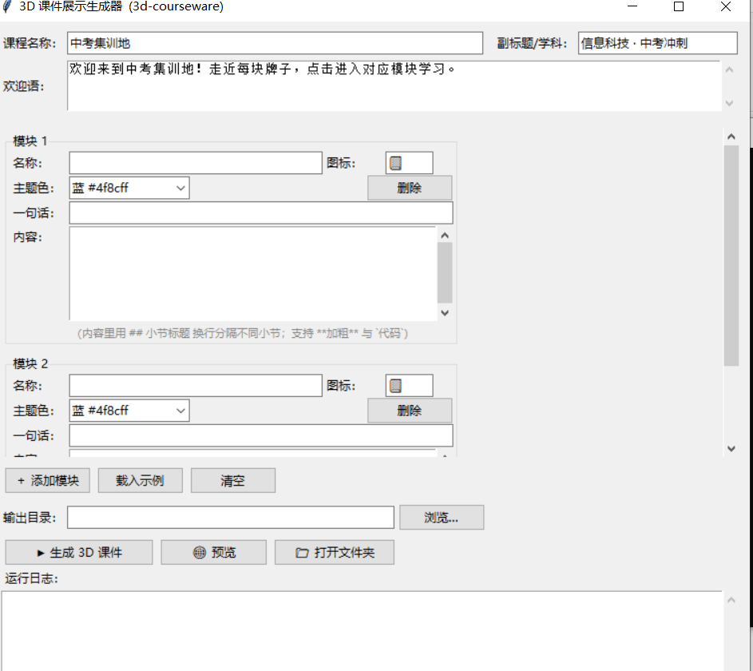

# 3D 课件展示技能（3d-courseware）

把一节课的复习/集训内容，做成一个**可探索的 3D 网页**：学生操控一只披风小猫
在广场上漫步，走近不同的**发光牌子**（每个牌子 = 一个学习模块，如 Windows / 网络 /
Word / Excel / PPT），按 `E` 或点击进入，弹出**分小节内容面板**（左小节导航、右讲解、
上/下一节切换）。

纯前端（Three.js + 原生 JS），**无需构建、无需联网、本地内置 Three.js**，
双击单文件即可运行，适合发给学生或分享给同事。

---

## 一、朋友怎么装这个技能（3 种方式）

1. **最简单**：把 `SKILL.md` 直接拖进 WorkBuddy 聊天框，让 AI 自动识别并安装。
2. **手动**：把整个 `3d-courseware` 文件夹复制到
   `~/.workbuddy/skills/3d-courseware/`（Windows 在
   `C:/Users/你/.workbuddy/skills/3d-courseware/`）。
3. **命令行**：`npx skills add iithink88/3d-courseware@3d-courseware`

装好后，对它说「帮我做一个 3D 课件」，或直接双击 `启动.bat` 用图形界面填内容。

---

## 二、老师怎么生成自己的课件

### 方式 A：图形界面（推荐，零代码）
双击 `启动.bat` → 填课程名 / 欢迎语 → 点「＋ 添加模块」加若干模块
（名称、图标 emoji、主题色、一句话简介、内容）→ 内容里用 `## 小节标题` 换行分节 →
点「▶ 生成 3D 课件」产出站点、「🌐 预览」本地看、「📁 打开文件夹」取走。
首次可点「载入示例」看完整的「中考集训地」五模块范例。



### 方式 B：写 JSON（适合批量 / 进阶）
照 `templates/courseware.example.json` 改一份你的课件 JSON，然后：
```bash
python scripts/generate.py --profile 你的课件.json --out ./我的课件
cd ./我的课件 && python -m http.server 8000
# 浏览器打开 http://localhost:8000
```

---

## 三、打包成单文件（方便分享）

生成的默认是多文件站点（需 http 打开）。想做成**一个 .html 双击即开**，用：
```bash
python scripts/pack_singlefile.py --src ./我的课件 --out 我的课件-单文件.html
```
打包脚本会把 Three.js 源码内联、改用运行时 blob 注入，**彻底离线、可微信分享**。
详见 `demo/README.md`。

---

## 四、示例 Demo（直接体验）

👉 **[点击这里直接在网页上操作演示「中考集训地」3D 课件](https://iithink88.github.io/3d-courseware/)**

> 用最新版 **Chrome / Edge** 打开，操控披风小猫漫步广场，走近发光牌子按 `E` 或点击进入学习（Windows / 网络 / Word / Excel / PPT 五大模块）。
> 操作：`WASD` 移动、鼠标拖拽转视角、手机有虚拟摇杆。

`demo/中考集训地-单文件.html` 是该 Demo 的**单文件成品**（1.36 MB，双击即跑，可下载离线使用）。
制作过程见 `demo/README.md`。

---

## 五、操作说明（给学生）

| 操作 | 按键 |
|---|---|
| 移动 | `W` `A` `S` `D` 或 方向键 |
| 转视角 | 按住鼠标拖动 / 触屏右半屏拖拽 |
| 进入模块 | 走近发光牌子，按 `E` 或 点击 |
| 关闭面板 | `Esc` 或 点关闭按钮 |
| 移动端 | 左半屏虚拟摇杆移动 + 右半屏转视角 |

---

## 六、目录结构

```
3d-courseware/
├─ SKILL.md                 # AI 执行指令（触发词 / 工作流）
├─ README.md                # 本文件
├─ 启动.bat                 # Windows 图形界面启动器
├─ LICENSE / .gitignore
├─ gui/gui.py               # 教师输入图形界面
├─ scripts/
│  ├─ generate.py           # 读课件 JSON → 产出多文件站点（build() 可被 GUI 调用）
│  └─ pack_singlefile.py    # 站点 → 单文件 HTML
├─ templates/               # index.html 外壳、app.js 引擎、courseware.example.json
├─ vendor/three.module.js   # 本地内置 Three.js（离线可用）
└─ demo/
   ├─ 中考集训地-单文件.html  # 示例成品（双击即跑）
   └─ README.md              # 该 Demo 的制作过程
```

## 七、注意事项

- 内容是纯文本小节，支持 `**加粗**` 与 `` `代码` ``，不写 HTML（已转义防注入）。
- 单课模块建议 ≤ 8 个，太多牌子会绕一大圈。
- Three.js 已内置，分享无需对方任何额外下载。
- 示例 `demo/` 内文件较大（Three.js 内联约 1.3 MB），属正常。
